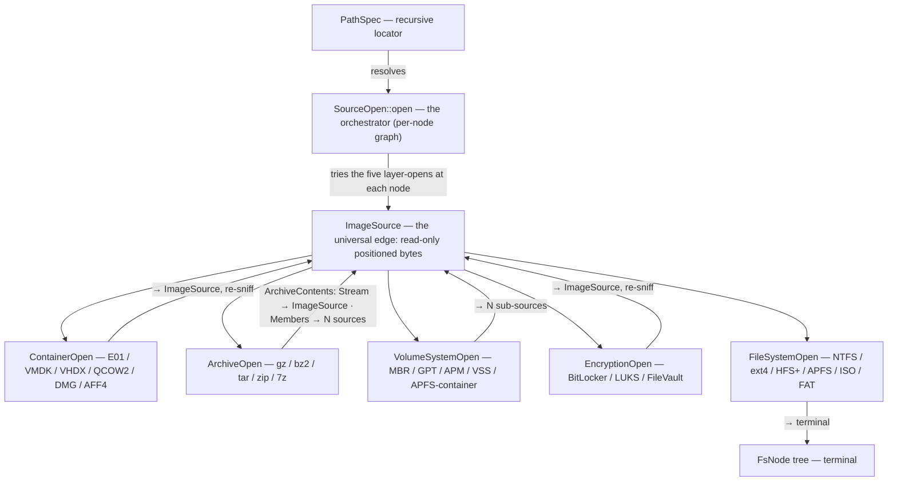

# Architecture

`forensic-vfs` defines **five layer-open traits**, each with two steps —
`probe()` (recognize) then `open()` (peel) — and one orchestrator, **`SourceOpen`**
(in `forensic-vfs-resolver`), which applies them as a **graph, not a fixed lane**:
at each node it tries the five layer-opens and descends, because archive, encryption,
volume, and container layers nest in any order on real evidence.

Example nestings a graph handles that a fixed lane would not:
`E01 → GPT → BitLocker → NTFS` (encryption after volume), `raw → LUKS → LVM → ext4`
(encryption before volume), `E01 → APFS-container(encrypted volume) → APFS` (encryption
is container metadata, not a separate step).

## The byte source

`ImageSource` is a positioned-read, `Send + Sync` trait with `read_at(&self, …)`
and **no write method**. This delivers three properties at once:

1. **Parallel reads** — `&self` shares one `Arc<dyn ImageSource>` across workers;
   a `Read + Seek` cursor's `&mut self` cannot.
2. **Read-only by construction** — no write API exists to misuse.
3. **Clean `dyn` composition** — `Send + Sync` are auto traits, so
   `Arc<dyn ImageSource>` is itself `Send + Sync`.

Adapters bridge the existing world: `FileSource` (positioned OS reads, no
`Mutex<File>`), `SubRange` (a byte window that is itself an `ImageSource`), and
`SourceCursor` (a `Read + Seek` view for legacy call sites).

## Identity and metadata

- **`FileId`** is filesystem-specific (`NtfsRef{entry,seq}`, `ExtInode{ino,gen}`,
  `ApfsOid{oid,xid}`, `FatDirEntry`, `IsoExtent`, `Opaque`), so a reused slot is
  never confused with the original.
- **`FsMeta`** carries the name/metadata allocation split (`Allocated | Deleted |
  Orphan`), per-timestamp `TimeSource` + `TimeResolution` (including NTFS's 100 ns
  `WinFileTime`), ADS/resource-fork stream info, and residency — without the eager
  run-list (runs come from `extents()` lazily).

## PathSpec

A recursive chain of `Layer` nodes. Identity is the structured enum, so raw path
bytes containing a delimiter can never collide two specs. Two text forms: a
**lossless canonical URI** (round-trip is a test- and fuzz-enforced invariant) and
a **lossy human `Display`**. Credentials are supplied out-of-band at resolve time,
never stored in the address.

## Crate structure and phases

| Crate | Role | Status |
|---|---|---|
| **`forensic-vfs`** | byte source, volume/encryption/filesystem traits, `PathSpec`, registry contracts | this crate |
| `forensic-vfs-engine` | registry + graph resolver + concurrent block cache, depending down on every reader | planned |
| `disk-forensic` / `disk4n6` | thin CLI over the engine | evolving |

Phasing (each step gated on the Case-001 Szechuan ingest, no regression): extract
the leaf → build the engine over existing readers → collapse the issen disk
wrappers → move 4n6mount onto the engine → add encryption/snapshots/nesting → in-tree
reader trait impls. The full plan lives in the
[design doc](https://github.com/SecurityRonin/disk-forensic/blob/main/docs/design/2026-07-06-universal-forensic-vfs.md).
