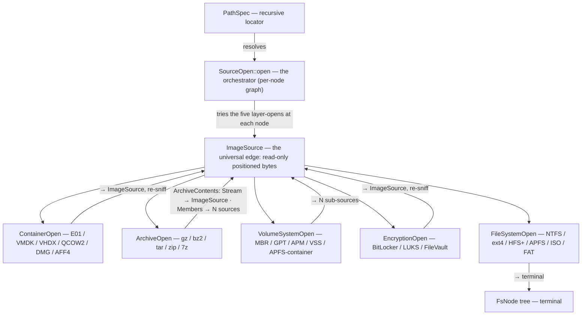

# Architecture

`forensic-vfs` defines **five layer-open traits**, each with two steps —
`probe()` (recognize) then `open()` (peel) — and one orchestrator, **`SourceOpen`**
(in `forensic-vfs-resolver`), which applies them as a **graph, not a fixed lane**:
at each node it tries the five layer-opens and descends, because archive, encryption,
volume, and container layers nest in any order on real evidence.

Example nestings a graph handles that a fixed lane would not:
`E01 → GPT → BitLocker → NTFS` (encryption after volume), `raw → LUKS → LVM → ext4`
(encryption before volume), `E01 → APFS-container(encrypted volume) → APFS` (encryption
is container metadata, not a separate step).

## The byte source

`ImageSource` is a positioned-read, `Send + Sync` trait with `read_at(&self, …)`
and **no write method**. This delivers three properties at once:

1. **Parallel reads** — `&self` shares one `Arc<dyn ImageSource>` across workers;
   a `Read + Seek` cursor's `&mut self` cannot.
2. **Read-only by construction** — no write API exists to misuse.
3. **Clean `dyn` composition** — `Send + Sync` are auto traits, so
   `Arc<dyn ImageSource>` is itself `Send + Sync`.

Adapters bridge the existing world: `FileSource` (positioned OS reads, no
`Mutex<File>`), `SubRange` (a byte window that is itself an `ImageSource`), and
`SourceCursor` (a `Read + Seek` view for legacy call sites).

## Identity and metadata

- **`FileId`** is filesystem-specific (`NtfsRef{entry,seq}`, `ExtInode{ino,gen}`,
  `ApfsOid{oid,xid}`, `FatDirEntry`, `IsoExtent`, `Opaque`), so a reused slot is
  never confused with the original.
- **`FsMeta`** carries the name/metadata allocation split (`Allocated | Deleted |
  Orphan`), per-timestamp `TimeSource` + `TimeResolution` (including NTFS's 100 ns
  `WinFileTime`), ADS/resource-fork stream info, and residency — without the eager
  run-list (runs come from `extents()` lazily).

## PathSpec

A recursive chain of `Layer` nodes. Identity is the structured enum, so raw path
bytes containing a delimiter can never collide two specs. Two text forms: a
**lossless canonical URI** (round-trip is a test- and fuzz-enforced invariant) and
a **lossy human `Display`**. Credentials are supplied out-of-band at resolve time,
never stored in the address.

## Crate structure

Three roles across three crates ([ADR 0007](decisions/0007-retire-standalone-engine.md)):

| Crate | Role | Status |
|---|---|---|
| **`forensic-vfs`** | byte source (`ImageSource`), the five `*Open` traits, `Openers` dispatch table, `PathSpec`, `FsMeta`, `FsKind` | published (0.4) — this crate |
| **`forensic-vfs-resolver`** | the `SourceOpen` orchestrator — `impl SourceOpen for Openers`, recursive graph descent, `walk`, `snapshot_view` | published (0.1) — this workspace |
| **`forensic-vfs-engine`** | `default_openers()` wiring the ~17 concrete readers + `Vfs::open(path)` host bootstrap + concurrent block cache | a **separate published repo** |
| `disk-forensic` / `disk4n6` | thin CLI over the engine | evolving |

The leaf carries the contracts and nothing that names a concrete format; the resolver
carries the reader-independent descent policy; the engine (its own repo, so 17 reader
trees never pollute the leaf's CI or audit surface) carries the concrete wiring. The
division and its rationale — including why the resolver was extracted from the leaf once
the archive layer forced richer selection policy — are recorded in
[ADR 0007](decisions/0007-retire-standalone-engine.md); the layer model in
[ADR 0003](decisions/0003-four-layer-composition.md); first-class archives in
[ADR 0008](decisions/0008-archives-as-probes.md).

## Frontier

The horizontal layers are strong — container and filesystem/archive readers implement
their contracts in production. The two vertical layers are the remaining work: the
`VolumeSystemOpen` (MBR/GPT/APM/VSS) and `EncryptionOpen` (BitLocker/LUKS/FileVault)
readers exist as crates but are not yet wired to the contract. See [PRD §7](PRD.md) for
the ranked coverage matrix and remaining work.
